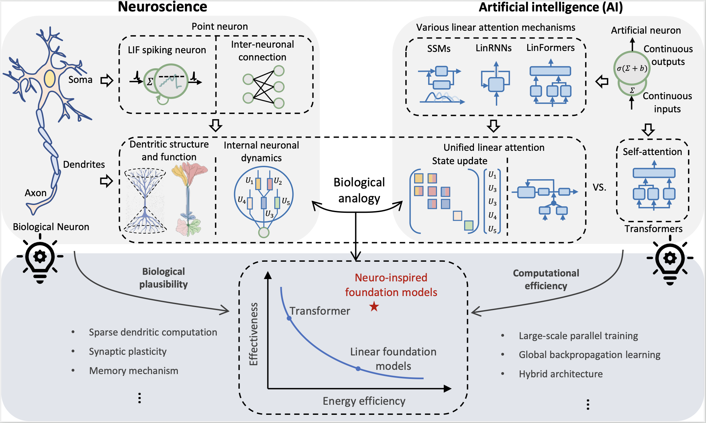
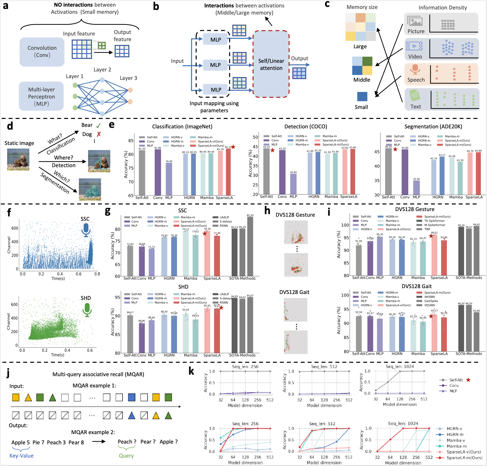
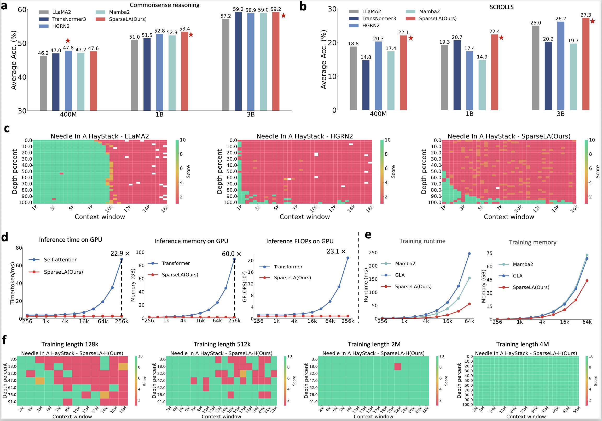

# Dendritic computation bridges neuroscience and foundation models

[](https://doi.org/10.5281/zenodo.21967669)

Official code release for the paper **“Dendritic computation bridges neuroscience and foundation models.”**

Repository: <https://github.com/BICLab/Dendritic-Foundation-Model>

## Overview

This work connects simplified dendritic computation with attention mechanisms in foundation models. It uses dendritic organization as a structural lens for linear attention, introduces the sparse-memory operator **SparseLA**, and studies the hybrid **SparseLA-H** architecture, which interleaves self-attention with SparseLA blocks.



Figure 1 summarizes the biological analogy that motivates the work: dendritic
structure and internal neuronal dynamics provide a common view of state
updates in linear attention, linking biological plausibility with efficient
foundation-model design.

The release covers the experiments associated with Figures 5 and 6:

- **Cross-modality token-mixer evaluation.** Figure 5 compares convolution, MLP, self-attention, and vector- and matrix-state variants of HGRN, Mamba, and SparseLA on static images, neuromorphic speech, neuromorphic vision, and associative recall.
- **Foundation-model architectures and long-context scaling.** Figure 6
  compares SparseLA with Transformer and linear foundation models in language
  understanding, reasoning, retrieval, training efficiency, inference
  efficiency, and long-context scaling. The code includes implementations of
  various foundation-model architectures and core modules for SparseLA-H
  training and inference.
- **Dendrite-inspired sparse memory.** SparseLA sparsifies memory updates by selecting a subset of branches, reducing computation while retaining memory capacity.
- **Hybrid long-context architecture.** SparseLA-H combines periodic self-attention with SparseLA for scalable long-context modeling.

## Repository map

| Paper component | Code |
| --- | --- |
| Figure 5 overview | [`figure5/`](figure5/) |
| Static image classification, detection, and segmentation | [`figure5/static_image/`](figure5/static_image/) |
| SHD and SSC neuromorphic speech | [`figure5/neuromorphic_speech/`](figure5/neuromorphic_speech/) |
| DVS128 Gesture and DVS128 Gait | [`figure5/neuromorphic_vision/`](figure5/neuromorphic_vision/) |
| Multi-Query Associative Recall (MQAR) | [`figure5/mqar/`](figure5/mqar/) |
| Figure 6 overview | [`figure6/`](figure6/) |
| Foundation-model architecture implementations | [`figure6/model_comparison/`](figure6/model_comparison/) |
| SparseLA-H long-context training and inference | [`figure6/long_context/`](figure6/long_context/) |
| vLLM inference integration | [`figure6/long_context/inference/`](figure6/long_context/inference/) |
| Sequence-parallel SparseLA module | [`figure6/long_context/sequence_parallel/`](figure6/long_context/sequence_parallel/) |

## Experimental figures

Figure 5 summarizes the cross-modality comparison and maps directly to
[`figure5/`](figure5/):



Figure 6 presents foundation-model comparisons and long-context extrapolation.
The corresponding code is organized under [`figure6/`](figure6/):



## Installation

Clone the repository:

```bash
git clone https://github.com/BICLab/Dendritic-Foundation-Model.git
cd Dendritic-Foundation-Model
```

The experiments use independent software stacks. Create a separate environment
for the component of interest and follow its setup guide:

- [Static image processing](figure5/static_image/)
- [Neuromorphic speech recognition](figure5/neuromorphic_speech/)
- [Neuromorphic vision recognition](figure5/neuromorphic_vision/)
- [Multi-Query Associative Recall](figure5/mqar/)
- [Foundation-model architecture comparison](figure6/model_comparison/)
- [SparseLA-H long-context training and inference](figure6/long_context/)

Each guide documents its dependencies, data preparation, configuration, and
launch commands.

## Data availability

All datasets used in the study are publicly available at the links reported in the paper:

- [ImageNet](https://www.image-net.org/)
- [COCO](https://cocodataset.org/)
- [ADE20K](https://ade20k.csail.mit.edu/)
- [SHD and SSC](https://zenkelab.org/datasets/)
- [DVS128 Gesture](https://research.ibm.com/publications/a-low-power-fully-event-based-gesture-recognition-system)
- [DVS128 Gait](https://github.com/zhangxiann/TPAMI_Gait_Identification)
- [MQAR](https://github.com/HazyResearch/zoology)
- [Commonsense Reasoning, SCROLLS, GSM8K, and MATH](https://github.com/EleutherAI/lm-evaluation-harness)
- [RULER](https://github.com/NVIDIA/RULER)

Additional data supporting the results are reported in the paper’s Extended Data Tables. Dataset licenses and access conditions are controlled by the respective providers.

## Code and model availability

The paper’s code-availability URL is <https://github.com/BICLab/Dendritic-Foundation-Model>.

The model-comparison directory provides implementations of SparseLA, MetaLA,
Mamba, Mamba2, HGRN2, TransNormer3, and LLaMA2. The long-context directory
provides SparseLA-H kernels and integration modules for sequence-parallel
training and vLLM inference.

## Acknowledgements and third-party code

The authors thank Prof. Giacomo Indiveri for insightful discussions. Funding acknowledgements are provided in the paper.

This repository incorporates or adapts code from Zoology, vLLM, Mamba,
Hugging Face Transformers, Flash Linear Attention, Meta-derived vision
utilities, and related CUDA/Triton projects. See
[`THIRD_PARTY.md`](THIRD_PARTY.md) for attribution and license information.

## Contributing and license

See [`CONTRIBUTING.md`](CONTRIBUTING.md) before submitting changes.

The authors’ original code and documentation are released under the
[Apache License 2.0](LICENSE). Bundled and adapted third-party files remain
governed by their own notices and licenses as documented in
[`THIRD_PARTY.md`](THIRD_PARTY.md).
